# Salon Lyol — End-to-End Entity Relationship Model

> **Status:** Working draft v0.1 — 2026-04-19  
> Phase 1 entities are fully attributed. Phase 2–4 entities are skeletons (named, primary relationships, minimal attributes). Expect 10–20% of Phase 1 schema to evolve through real-world use.

---

## Entity Inventory by Phase

| Phase | Entity | Notes |
|-------|--------|-------|
| **1** | Tenant | Multi-tenant anchor; single row in Phase 1 |
| **1** | User | Staff login accounts |
| **1** | Provider | Staff member who appears in the appointment book |
| **1** | ProviderSchedule | Weekly working hours template per provider |
| **1** | ProviderScheduleException | Date-specific overrides (holidays, one-off days) |
| **1** | TenantOperatingHours | Salon open/close hours by day of week |
| **1** | Station | Schedulable physical chairs (styling, colour application, multi-purpose) |
| **1** | ServiceCategory | Styling / Colouring / Extensions |
| **1** | Service | Individual service definition with duration and processing time |
| **1** | ProviderServicePrice | Per-provider price and cost override with effective date range |
| **1** | ClientHousehold | Family/household grouping for clients |
| **1** | Client | Client record — the person receiving services |
| **1** | AppointmentRequest | Raw inbound request before staff confirm |
| **1** | AppointmentRequestItem | Service line items within a request |
| **1** | Appointment | Container for a client's visit |
| **1** | AppointmentItem | Atomic unit: one service, one provider, one time window |
| **1** | AppointmentReminder | Scheduled email/SMS reminders |
| **2** | Campaign | Marketing campaign for booking attribution |
| **2** | Deposit | Client deposit against a future appointment |
| **2** | Sale | POS transaction closing an appointment |
| **2** | SaleItem | Line item within a sale |
| **2** | Payment | Payment record against a sale |
| **2** | CrmConversation | AI-assisted email or chat conversation thread |
| **2** | CrmMessage | Individual message within a CRM conversation |
| **3** | TenantSubscriptionPlan | SaaS plan tiers |
| **3** | TenantSubscription | A tenant's active plan |
| **4** | VoiceCall | AI voice call record |

---

## ER Diagram

```mermaid
erDiagram

    %% ─────────────────────────────────────────
    %% PHASE 1 — CORE
    %% ─────────────────────────────────────────

    TENANT {
        uuid id PK
        string name
        string slug
        boolean is_active
        timestamptz created_at
        timestamptz updated_at
    }

    USER {
        uuid id PK
        uuid tenant_id FK
        string email
        string password_hash
        enum role
        boolean is_active
        timestamptz created_at
        timestamptz updated_at
    }

    PROVIDER {
        uuid id PK
        uuid tenant_id FK
        uuid user_id FK
        string first_name
        string last_name
        string display_name
        string milano_code
        enum provider_type
        boolean is_owner
        boolean is_active
        timestamptz created_at
        timestamptz updated_at
    }

    PROVIDER_SCHEDULE {
        uuid id PK
        uuid tenant_id FK
        uuid provider_id FK
        int day_of_week
        time start_time
        time end_time
        boolean is_working
        date effective_from
        date effective_to
    }

    PROVIDER_SCHEDULE_EXCEPTION {
        uuid id PK
        uuid tenant_id FK
        uuid provider_id FK
        date exception_date
        boolean is_working
        time start_time
        time end_time
        text note
    }

    TENANT_OPERATING_HOURS {
        uuid id PK
        uuid tenant_id FK
        int day_of_week
        boolean is_open
        time open_time
        time close_time
    }

    STATION {
        uuid id PK
        uuid tenant_id FK
        uuid default_provider_id FK
        string name
        enum station_type
        boolean is_active
    }

    SERVICE_CATEGORY {
        uuid id PK
        uuid tenant_id FK
        string name
        int display_order
        boolean is_active
    }

    SERVICE {
        uuid id PK
        uuid tenant_id FK
        uuid category_id FK
        string service_code
        string name
        text description
        enum haircut_type
        enum pricing_type
        decimal default_price
        int duration_minutes
        int processing_offset_minutes
        int processing_duration_minutes
        boolean is_addon
        boolean requires_prior_consultation
        boolean is_active
        int display_order
        timestamptz created_at
        timestamptz updated_at
    }

    PROVIDER_SERVICE_PRICE {
        uuid id PK
        uuid tenant_id FK
        uuid provider_id FK
        uuid service_id FK
        decimal price
        decimal cost
        date effective_from
        date effective_to
        boolean is_active
    }

    CLIENT_HOUSEHOLD {
        uuid id PK
        uuid tenant_id FK
        string name
        timestamptz created_at
    }

    CLIENT {
        uuid id PK
        uuid tenant_id FK
        uuid household_id FK
        uuid preferred_provider_id FK
        uuid referred_by_client_id FK
        string client_code
        string first_name
        string last_name
        string pronouns
        string email
        string home_phone
        string work_phone
        string cell_phone
        string address_line
        string city
        string province
        string postal_code
        string country
        text special_instructions
        boolean is_vip
        string photo_url
        enum referral_source
        int no_show_count
        int late_cancellation_count
        decimal account_balance
        timestamptz waiver_acknowledged_at
        timestamptz cancellation_policy_acknowledged_at
        boolean is_active
        timestamptz created_at
        timestamptz updated_at
    }

    APPOINTMENT_REQUEST {
        uuid id PK
        uuid tenant_id FK
        uuid reviewed_by_user_id FK
        uuid converted_to_appointment_id FK
        string first_name
        string last_name
        string email
        string phone
        string pronouns
        string submitted_by_name
        date desired_date
        text desired_time_note
        enum source
        text special_note
        boolean waiver_acknowledged
        boolean cancellation_policy_acknowledged
        enum status
        text staff_notes
        timestamptz submitted_at
        timestamptz reviewed_at
        timestamptz created_at
        timestamptz updated_at
    }

    APPOINTMENT_REQUEST_ITEM {
        uuid id PK
        uuid request_id FK
        uuid converted_to_item_id FK
        int sequence
        string service_name
        string preferred_provider_name
    }

    APPOINTMENT {
        uuid id PK
        uuid tenant_id FK
        uuid client_id FK
        uuid request_id FK
        uuid created_by_user_id FK
        uuid campaign_id FK
        date appointment_date
        enum source
        enum status
        text cancellation_reason
        int cancellation_charge_pct
        boolean is_recurring
        uuid recurring_group_id
        text notes
        timestamptz created_at
        timestamptz updated_at
    }

    APPOINTMENT_ITEM {
        uuid id PK
        uuid tenant_id FK
        uuid appointment_id FK
        uuid service_id FK
        uuid provider_id FK
        uuid station_id FK
        int sequence
        timestamptz start_time
        int duration_minutes
        int duration_override_minutes
        decimal price
        boolean price_is_locked
        decimal cost
        enum status
        text notes
        timestamptz created_at
        timestamptz updated_at
    }

    APPOINTMENT_REMINDER {
        uuid id PK
        uuid tenant_id FK
        uuid appointment_id FK
        enum channel
        timestamptz scheduled_at
        timestamptz sent_at
        enum status
    }

    %% ─────────────────────────────────────────
    %% PHASE 2 — POS + CRM (skeletons)
    %% ─────────────────────────────────────────

    CAMPAIGN {
        uuid id PK
        uuid tenant_id FK
        string name
        boolean is_active
    }

    DEPOSIT {
        uuid id PK
        uuid tenant_id FK
        uuid client_id FK
        uuid appointment_id FK
        decimal amount
        enum status
        timestamptz created_at
    }

    SALE {
        uuid id PK
        uuid tenant_id FK
        uuid appointment_id FK
        uuid client_id FK
        decimal total_amount
        enum status
        timestamptz created_at
    }

    SALE_ITEM {
        uuid id PK
        uuid sale_id FK
        uuid appointment_item_id FK
        text description
        decimal amount
        int quantity
    }

    PAYMENT {
        uuid id PK
        uuid tenant_id FK
        uuid sale_id FK
        decimal amount
        enum method
        timestamptz created_at
    }

    CRM_CONVERSATION {
        uuid id PK
        uuid tenant_id FK
        uuid client_id FK
        enum channel
        enum status
        timestamptz created_at
    }

    CRM_MESSAGE {
        uuid id PK
        uuid conversation_id FK
        enum direction
        text content
        timestamptz sent_at
    }

    %% ─────────────────────────────────────────
    %% PHASE 3 — MULTI-TENANCY (skeletons)
    %% ─────────────────────────────────────────

    TENANT_SUBSCRIPTION_PLAN {
        uuid id PK
        string name
        decimal monthly_price
    }

    TENANT_SUBSCRIPTION {
        uuid id PK
        uuid tenant_id FK
        uuid plan_id FK
        enum status
        date started_at
        date ended_at
    }

    %% ─────────────────────────────────────────
    %% PHASE 4 — VOICE AI (skeleton)
    %% ─────────────────────────────────────────

    VOICE_CALL {
        uuid id PK
        uuid tenant_id FK
        uuid client_id FK
        int duration_seconds
        string transcript_url
        timestamptz created_at
    }

    %% ─────────────────────────────────────────
    %% RELATIONSHIPS
    %% ─────────────────────────────────────────

    TENANT ||--o{ USER : "has"
    TENANT ||--o{ PROVIDER : "has"
    TENANT ||--o{ STATION : "has"
    TENANT ||--o{ SERVICE_CATEGORY : "has"
    TENANT ||--o{ SERVICE : "has"
    TENANT ||--o{ CLIENT : "has"
    TENANT ||--o{ APPOINTMENT : "has"
    TENANT ||--|{ TENANT_OPERATING_HOURS : "defines"
    TENANT ||--o| TENANT_SUBSCRIPTION : "has"

    USER ||--o| PROVIDER : "is"

    PROVIDER ||--o{ PROVIDER_SCHEDULE : "has"
    PROVIDER ||--o{ PROVIDER_SCHEDULE_EXCEPTION : "has"
    PROVIDER ||--o{ PROVIDER_SERVICE_PRICE : "offers"
    PROVIDER ||--o{ APPOINTMENT_ITEM : "assigned to"
    PROVIDER ||--o{ STATION : "default at"

    SERVICE_CATEGORY ||--|{ SERVICE : "contains"
    SERVICE ||--o{ PROVIDER_SERVICE_PRICE : "priced via"
    SERVICE ||--o{ APPOINTMENT_ITEM : "booked as"

    CLIENT_HOUSEHOLD ||--o{ CLIENT : "groups"
    CLIENT }o--o| PROVIDER : "prefers"
    CLIENT }o--o| CLIENT : "referred by"
    CLIENT ||--o{ APPOINTMENT : "books"
    CLIENT ||--o{ DEPOSIT : "places"
    CLIENT ||--o{ CRM_CONVERSATION : "has"
    CLIENT ||--o{ VOICE_CALL : "has"

    APPOINTMENT_REQUEST ||--|{ APPOINTMENT_REQUEST_ITEM : "contains"
    APPOINTMENT_REQUEST }o--o| USER : "reviewed by"
    APPOINTMENT_REQUEST }o--o| APPOINTMENT : "converts to"
    APPOINTMENT_REQUEST_ITEM }o--o| APPOINTMENT_ITEM : "converts to"

    APPOINTMENT }o--o| APPOINTMENT_REQUEST : "sourced from"
    APPOINTMENT }o--o| CAMPAIGN : "attributed to"
    APPOINTMENT ||--|{ APPOINTMENT_ITEM : "contains"
    APPOINTMENT ||--o{ APPOINTMENT_REMINDER : "triggers"
    APPOINTMENT ||--o{ DEPOSIT : "holds"

    APPOINTMENT_ITEM }o--o| STATION : "uses"

    SALE }o--o| APPOINTMENT : "closes"
    SALE ||--o{ SALE_ITEM : "contains"
    SALE ||--o{ PAYMENT : "settled by"
    SALE_ITEM }o--o| APPOINTMENT_ITEM : "for"

    CRM_CONVERSATION ||--o{ CRM_MESSAGE : "contains"

    TENANT_SUBSCRIPTION_PLAN ||--o{ TENANT_SUBSCRIPTION : "governs"
```



---

## Entity Reference — Phase 1

### Tenant

The top-level multi-tenancy anchor. In Phase 1 there is exactly one row (Salon Lyol). In Phase 3, each salon is a row.

| Field | Type | Notes |
|-------|------|-------|
| id | uuid PK | |
| name | string | "Salon Lyol" |
| slug | string | URL-safe identifier, unique; used for subdomain routing in Phase 3 |
| is_active | boolean | Soft-disable a tenant without deleting |
| created_at / updated_at | timestamptz | |

---

### User

Anyone who can log into the system. In Phase 1, all Users are staff members.

| Field | Type | Notes |
|-------|------|-------|
| id | uuid PK | |
| tenant_id | uuid FK → Tenant | |
| email | string | Unique per tenant |
| password_hash | string | bcrypt or Argon2 |
| role | enum | `super_admin`, `tenant_admin`, `staff` |
| is_active | boolean | Deactivated users cannot log in |

**role enum:**
- `super_admin` — Anthropic / platform operator (no tenant_id)
- `tenant_admin` — salon owner / manager
- `staff` — colourist, stylist, dualist

---

### Provider

A staff member who delivers services and appears as a column in the appointment book. Every Provider is also a User; not every User is a Provider (an admin-only account would be a User without a Provider record).

| Field | Type | Notes |
|-------|------|-------|
| id | uuid PK | |
| tenant_id | uuid FK → Tenant | |
| user_id | uuid FK → User | 1:1 — the login account for this provider |
| first_name | string | |
| last_name | string | |
| display_name | string | Name shown as the column header in the appointment book (e.g., "JJ", "Joanne") |
| milano_code | string | Milano's short identifier (e.g., "JOANNE", "SARAH"); kept for data migration reference |
| provider_type | enum | `stylist`, `colourist`, `dualist` — informational only; capability is determined by ProviderServicePrice |
| is_owner | boolean | True for Jini (JJ); owner may have elevated permissions |
| is_active | boolean | Inactive providers do not appear in the appointment book |

**provider_type enum note:** Type is informational — it does not gate which services a provider can deliver. The `ProviderServicePrice` junction is the authoritative source of capability.

---

### ProviderSchedule

The provider's recurring weekly working schedule. Stored as a template (keyed by day_of_week) that repeats each week. Each row represents one day of the week.

| Field | Type | Notes |
|-------|------|-------|
| id | uuid PK | |
| tenant_id | uuid FK → Tenant | |
| provider_id | uuid FK → Provider | |
| day_of_week | int | 0 = Monday … 6 = Sunday |
| start_time | time | Working start time |
| end_time | time | Working end time |
| is_working | boolean | False = this is a regular day off for this provider |
| effective_from | date | When this schedule version took effect |
| effective_to | date | Nullable — null means currently active |

**Salon operating days:** Tuesday–Saturday only. All providers will have `is_working = false` for Monday (day 0) and Sunday (day 6). Most providers work 4 of the 5 operating days; Jini (JJ) works all 5.

---

### ProviderScheduleException

A one-off override to the weekly template — a holiday, a day off request, or an extra working day.

| Field | Type | Notes |
|-------|------|-------|
| id | uuid PK | |
| tenant_id | uuid FK → Tenant | |
| provider_id | uuid FK → Provider | |
| exception_date | date | The specific date being overridden |
| is_working | boolean | False = day off; true = working on a normally-off day |
| start_time | time | Nullable — overrides normal start time if set |
| end_time | time | Nullable — overrides normal end time if set |
| note | text | Optional reason (e.g., "vacation", "training day") |

---

### TenantOperatingHours

The salon's opening hours by day of week. Used to constrain appointment booking windows and online request validation.

Salon Lyol hours:

| Day | Open | Close |
|-----|------|-------|
| Monday | Closed | — |
| Tuesday | 09:00 | 18:00 |
| Wednesday | 09:00 | 20:00 |
| Thursday | 09:00 | 20:00 |
| Friday | 09:00 | 18:00 |
| Saturday | 09:00 | 17:00 |
| Sunday | Closed | — |

| Field | Type | Notes |
|-------|------|-------|
| id | uuid PK | |
| tenant_id | uuid FK → Tenant | |
| day_of_week | int | 0 = Monday … 6 = Sunday |
| is_open | boolean | False for Monday and Sunday |
| open_time | time | Nullable when is_open = false |
| close_time | time | Nullable when is_open = false |

---

### Station

A physical station (chair) that can be assigned to an appointment item. Only stations that constrain scheduling are modelled here — processing chairs and shampoo sinks are managed informally by staff and are not tracked.

| Field | Type | Notes |
|-------|------|-------|
| id | uuid PK | |
| tenant_id | uuid FK → Tenant | |
| default_provider_id | uuid FK → Provider | Nullable — null for multi_purpose stations |
| name | string | E.g., "Joanne's Colour Chair", "Multi-purpose A" |
| station_type | enum | `styling`, `colour_application`, `multi_purpose` |
| is_active | boolean | |

**station_type enum:**
- `styling` — 6 chairs, each assigned to a specific stylist
- `colour_application` — 3 chairs, each assigned to a specific colourist
- `multi_purpose` — 2 shared chairs, no default provider

**Not modelled as schedulable resources:** colour_processing (2 chairs), shampoo_sink (4 sinks). These are always available given the typical concurrent provider count and are managed informally.

---

### ServiceCategory

Top-level grouping of services.

| Field | Type | Notes |
|-------|------|-------|
| id | uuid PK | |
| tenant_id | uuid FK → Tenant | |
| name | string | "Styling", "Colouring", "Extensions" |
| display_order | int | Controls UI ordering |
| is_active | boolean | |

---

### Service

A specific service offered by the salon. The source of truth for duration, processing time, and default pricing. Per-provider price overrides live in ProviderServicePrice.

| Field | Type | Notes |
|-------|------|-------|
| id | uuid PK | |
| tenant_id | uuid FK → Tenant | |
| category_id | uuid FK → ServiceCategory | |
| service_code | string | Short identifier used in the appointment book display (e.g., "CFC", "STY2N") |
| name | string | Full display name (e.g., "Color Full Color", "Type 2 Haircut") |
| description | text | Nullable — client-facing description |
| haircut_type | enum | Nullable — only set for haircut services: `type_1`, `type_2`, `type_2_plus` |
| pricing_type | enum | `fixed` (price set at booking) or `hourly` (price finalized at checkout) |
| default_price | decimal | Nullable — fallback when no ProviderServicePrice exists for this provider |
| duration_minutes | int | Total slot length booked in the calendar |
| processing_offset_minutes | int | Default 0 — minutes after service start when processing begins (provider becomes free) |
| processing_duration_minutes | int | Default 0 — length of the processing window; 0 for non-colour services |
| is_addon | boolean | True for Toner, Metal Detox/Olaplex, Heat Tool Finish, Milbon add-on |
| requires_prior_consultation | boolean | True for extension installation services |
| is_active | boolean | |
| display_order | int | |

**Computed values (not stored):**
- `processing_start_time` = `AppointmentItem.start_time + processing_offset_minutes`
- `processing_end_time` = `processing_start_time + processing_duration_minutes`
- `provider_free_from` = `start_time + processing_offset_minutes` (when the colourist can take another client)
- `provider_busy_again` = `processing_start_time + processing_duration_minutes` (when the colourist returns)

**Example — Color Full Color:**
- duration_minutes = 150 (2.5 hrs total)
- processing_offset_minutes = 45 (colour applied for 45 min, then processing starts)
- processing_duration_minutes = 45 (45 min processing; provider free during this window)
- Provider is free from minute 45 to minute 90 — that's the window to slot in another client's colour application

---

### ProviderServicePrice

The junction between Provider and Service. Records which services a provider delivers, at what price, and with what materials cost. Also serves as the capability gate — if a provider has no entry for a service, they cannot deliver it.

| Field | Type | Notes |
|-------|------|-------|
| id | uuid PK | |
| tenant_id | uuid FK → Tenant | |
| provider_id | uuid FK → Provider | |
| service_id | uuid FK → Service | |
| price | decimal | Provider's price for this service |
| cost | decimal | Nullable — materials cost (colour product, treatment, etc.) used for margin/commission |
| effective_from | date | When this price took effect |
| effective_to | date | Nullable — null = currently active |
| is_active | boolean | |

**Unique constraint:** `(tenant_id, provider_id, service_id, effective_from)` — one price record per provider/service/date combination.

**Price lookup at booking:** The scheduler selects the active record where `effective_from <= booking_date AND (effective_to IS NULL OR effective_to >= booking_date)`. The price is then **captured** on AppointmentItem.price for historical integrity — future price changes do not affect past appointments.

**Fringe/Bang Cut note:** Some services have the same price for all providers ($20 flat). For these, ProviderServicePrice can either store identical rows for all providers, or the fallback `Service.default_price` is used (if ProviderServicePrice has no row for that provider/service). Both approaches are valid; prefer explicit rows for auditability.

---

### ClientHousehold

Groups family members who share a household. Used for reporting and relationship tracking.

| Field | Type | Notes |
|-------|------|-------|
| id | uuid PK | |
| tenant_id | uuid FK → Tenant | |
| name | string | E.g., "Ferguson Family" |
| created_at | timestamptz | |

---

### Client

The person receiving services. Not a system login in Phase 1 — clients interact via the booking request form and email only.

| Field | Type | Notes |
|-------|------|-------|
| id | uuid PK | |
| tenant_id | uuid FK → Tenant | |
| household_id | uuid FK → ClientHousehold | Nullable |
| preferred_provider_id | uuid FK → Provider | Nullable — their usual stylist/colourist |
| referred_by_client_id | uuid FK → Client | Nullable — self-referential; who referred them |
| client_code | string | Short identifier, unique per tenant (e.g., FERGF1); generated on creation |
| first_name | string | |
| last_name | string | |
| pronouns | string | Nullable (e.g., "he/him", "she/her", "they/them") |
| email | string | Nullable — primary contact for reminders |
| home_phone | string | Nullable |
| work_phone | string | Nullable |
| cell_phone | string | Nullable |
| address_line | string | Nullable |
| city | string | Nullable |
| province | string | Nullable (e.g., "ON") |
| postal_code | string | Nullable |
| country | string | Default "CA" |
| special_instructions | text | Nullable — shown to staff at booking time (allergies, VIP notes, preferences) |
| is_vip | boolean | Default false — formal flag alongside free-text special_instructions |
| photo_url | string | Nullable — stored in object storage (GCS/Azure Blob); not in DB |
| referral_source | enum | Nullable: `client_referral`, `google`, `instagram`, `walk_by`, `other` |
| no_show_count | int | Default 0 — incremented when Appointment.status = no_show |
| late_cancellation_count | int | Default 0 — incremented on late cancellations |
| account_balance | decimal | Default 0 — for Phase 2 POS on-account functionality |
| waiver_acknowledged_at | timestamptz | Nullable — when the client acknowledged the salon waiver |
| cancellation_policy_acknowledged_at | timestamptz | Nullable — when the client acknowledged the cancellation policy |
| is_active | boolean | Default true |
| created_at / updated_at | timestamptz | |

**client_code generation:** `UPPER(last_name[0:4]) + UPPER(first_name[0:1]) + sequence_digit` padded to ensure uniqueness per tenant. Example: Ferguson, Frederick → FERGF1.

**no_show_count / late_cancellation_count:** Surfaced to staff in the Special Instructions popup at booking time (as seen in Milano). Incremented by triggers or application logic when appointment status changes. Not recalculated from Appointment history on every read — maintained as counters.

---

### AppointmentRequest

A raw inbound booking request before staff review and confirm it. Submitted via the booking form or created manually by staff from a phone/email inquiry.

The request stores client contact details as free text — the client may not yet exist in the system, or may be a new client whose record is created when the appointment is confirmed.

| Field | Type | Notes |
|-------|------|-------|
| id | uuid PK | |
| tenant_id | uuid FK → Tenant | |
| reviewed_by_user_id | uuid FK → User | Nullable — set when a staff member reviews the request |
| converted_to_appointment_id | uuid FK → Appointment | Nullable — set when confirmed |
| first_name | string | |
| last_name | string | |
| email | string | |
| phone | string | |
| pronouns | string | Nullable |
| submitted_by_name | string | Nullable — populated when form is submitted on behalf of a guest |
| desired_date | date | Client's preferred date — not a commitment |
| desired_time_note | text | Free text: "anytime", "after 2pm", "morning preferred" |
| source | enum | `online_form`, `email`, `phone`, `walk_in` |
| special_note | text | Nullable — client's free-text notes |
| waiver_acknowledged | boolean | True if the client acknowledged the waiver at submission time |
| cancellation_policy_acknowledged | boolean | True if the client acknowledged the cancellation policy at submission |
| status | enum | `new`, `reviewed`, `converted`, `declined` |
| staff_notes | text | Nullable — internal notes added by staff during review |
| submitted_at | timestamptz | When the request was received |
| reviewed_at | timestamptz | Nullable |
| created_at / updated_at | timestamptz | |

**source enum note:** `online_form` = submitted via the booking form; `email` = staff manually created from a natural-language email; `phone` = staff manually created from a call; `walk_in` = client arrived without a prior request.

**Phase 2 note:** The AI CRM (Phase 2) will parse inbound emails to info@salonlyol.ca and auto-create AppointmentRequest records with `source = email`, replacing the current manual staff entry.

---

### AppointmentRequestItem

The service line items within a booking request. Stores the client's stated preferences as free text (not FKs) because the request exists before staff have matched it to real Service and Provider records.

| Field | Type | Notes |
|-------|------|-------|
| id | uuid PK | |
| request_id | uuid FK → AppointmentRequest | |
| converted_to_item_id | uuid FK → AppointmentItem | Nullable — set when the request item is confirmed as a real booking |
| sequence | int | 1 or 2 — position within the request (form supports up to 2 services) |
| service_name | string | As selected in the form (e.g., "Special Updo", "Type 1 Haircut") |
| preferred_provider_name | string | As selected in the form (e.g., "Asami", "JJ") |

---

### Appointment

The container for a client's visit. Groups one or more AppointmentItems. Duration, total price, and involved providers all derive from its items.

| Field | Type | Notes |
|-------|------|-------|
| id | uuid PK | |
| tenant_id | uuid FK → Tenant | |
| client_id | uuid FK → Client | |
| request_id | uuid FK → AppointmentRequest | Nullable — set if this appointment was converted from a request |
| created_by_user_id | uuid FK → User | The staff member who created or confirmed the appointment |
| campaign_id | uuid FK → Campaign | Nullable — Phase 2; FK included now to avoid future migration |
| appointment_date | date | The date of the visit; must match AppointmentItem start_times |
| source | enum | `online_form`, `email`, `phone`, `walk_in`, `staff_entered` |
| status | enum | `requested`, `confirmed`, `in_progress`, `completed`, `cancelled`, `no_show` |
| cancellation_reason | text | Nullable |
| cancellation_charge_pct | int | Nullable — 0, 50, or 100; set per the cancellation policy when cancelled or no_show |
| is_recurring | boolean | Default false — true for standing appointments |
| recurring_group_id | uuid | Nullable — groups all instances of a recurring appointment series |
| notes | text | Nullable — internal staff notes |
| created_at / updated_at | timestamptz | |

**status enum transitions:**
```
requested → confirmed → in_progress → completed
requested → declined (via AppointmentRequest.status)
confirmed → cancelled
confirmed → no_show
```

**cancellation_charge_pct logic:**
- Cancel 2+ days before → 0%
- Cancel < 2 days before → 50%
- Same/next-day booking cancel < 4 hrs before → 50%
- No-show → 100%

**Derived fields (not stored):**
- `total_price` = SUM(AppointmentItem.price) where status != cancelled
- `total_duration_minutes` = SUM(AppointmentItem.duration_minutes)
- `providers` = DISTINCT(AppointmentItem.provider_id)
- `start_time` = MIN(AppointmentItem.start_time)
- `end_time` = MAX(AppointmentItem.start_time + AppointmentItem.duration_minutes)

---

### AppointmentItem

The atomic unit of scheduling. One service, delivered by one provider, at one station, in one defined time window. Scheduling optimization (idle-time minimization) operates at this level.

| Field | Type | Notes |
|-------|------|-------|
| id | uuid PK | |
| tenant_id | uuid FK → Tenant | |
| appointment_id | uuid FK → Appointment | |
| service_id | uuid FK → Service | |
| provider_id | uuid FK → Provider | |
| station_id | uuid FK → Station | Nullable — null for add-on services that don't require a chair |
| sequence | int | Order within the appointment (1, 2, 3…) — used for service sequencing |
| start_time | timestamptz | Scheduled start |
| duration_minutes | int | Copied from Service.duration_minutes at booking; may differ from current service value |
| duration_override_minutes | int | Nullable — staff override for variable-duration services (e.g., extensions) |
| price | decimal | **Captured at booking time** — historical integrity; does not change if price list changes |
| price_is_locked | boolean | Default true; false for hourly services (pricing_type = hourly) until checkout |
| cost | decimal | Nullable — materials cost captured at booking time from ProviderServicePrice |
| status | enum | `pending`, `in_progress`, `completed`, `cancelled` |
| notes | text | Nullable — e.g., colour formula notes, "PINK", style instructions |
| created_at / updated_at | timestamptz | |

**Computed values (not stored):**
- `end_time` = `start_time + INTERVAL duration_minutes MINUTES`
- `processing_start_time` = `start_time + INTERVAL service.processing_offset_minutes MINUTES`
- `processing_end_time` = `processing_start_time + INTERVAL service.processing_duration_minutes MINUTES`

**Colour processing example — Frederick's Color Full Color with Joanne:**
- start_time = 09:00
- duration_minutes = 150
- Service.processing_offset_minutes = 45
- Service.processing_duration_minutes = 45
- Joanne is free from 09:45 to 10:30 → Jason's Lame Color application can be scheduled in this window
- Frederick moves to a processing chair at 09:45; Joanne takes Jason at her application chair

**sequence note:** Determines the preferred ordering of services within an appointment. The scheduler should warn (not hard-block) when sequencing rules are violated (e.g., colour item scheduled after cut item). Common rules:
- Colour application before cut
- Treatments between washes and finish
- Blowdry / style last

---

### AppointmentReminder

A scheduled communication sent to the client before their appointment. Currently sent ~3 days before (per salonlyol.ca policy). Modelled as Phase 1 since reminders are an existing operational feature.

| Field | Type | Notes |
|-------|------|-------|
| id | uuid PK | |
| tenant_id | uuid FK → Tenant | |
| appointment_id | uuid FK → Appointment | |
| channel | enum | `email`, `sms` |
| scheduled_at | timestamptz | When the reminder should be sent |
| sent_at | timestamptz | Nullable — set when actually sent |
| status | enum | `scheduled`, `sent`, `failed`, `cancelled` |

---

## Entity Reference — Phase 2 (Skeletons)

### Campaign
Marketing campaign for attributing appointments to a promotional source.
- Relationships: Appointment `}o--o|` Campaign

### Deposit
Non-refundable client deposit against a future appointment. Transferable if rescheduled within policy window.
- Relationships: Client `||--o{` Deposit, Appointment `||--o{` Deposit

### Sale
POS transaction that closes an appointment. Created at checkout.
- Relationships: Appointment `|o--||` Sale, Sale `||--o{` SaleItem, Sale `||--o{` Payment

### SaleItem
A line item within a sale — typically one per AppointmentItem, plus retail product sales.
- Relationships: Sale `||--o{` SaleItem, SaleItem `}o--o|` AppointmentItem

### Payment
A payment record against a sale. A sale may have multiple payments (split tender).
- Relationships: Sale `||--o{` Payment

### CrmConversation
An AI-assisted conversation thread with a client over email or chat.
- Relationships: Client `||--o{` CrmConversation, CrmConversation `||--o{` CrmMessage

### CrmMessage
An individual message within a CRM conversation (inbound from client or outbound from AI/staff).
- Relationships: CrmConversation `||--o{` CrmMessage

---

## Entity Reference — Phase 3 (Skeletons)

### TenantSubscriptionPlan
SaaS pricing tiers for multi-tenant billing.

### TenantSubscription
A tenant's active subscription to a plan.
- Relationships: Tenant `||--o|` TenantSubscription, TenantSubscriptionPlan `||--o{` TenantSubscription

---

## Entity Reference — Phase 4 (Skeleton)

### VoiceCall
An AI voice call record — transcript, duration, linked client.
- Relationships: Client `||--o{` VoiceCall

---

## Key Design Decisions

### 1. Multi-tenant from day one
Every tenant-scoped table includes `tenant_id`. In Phase 1, all queries filter by the single Salon Lyol tenant_id. In Phase 3, multi-tenancy is activated by adding tenant resolution to the request path — no schema migration required.

### 2. Provider capability via ProviderServicePrice, not provider_type
`Provider.provider_type` (stylist/colourist/dualist) is informational metadata. The system's source of truth for "can this provider deliver this service?" is whether a `ProviderServicePrice` row exists for that `(provider_id, service_id)` pair. This handles cross-trained providers, new services, and exceptions without schema changes.

### 3. Processing time on Service, not as separate AppointmentItems
Colour processing time (where the provider is free but the chair is occupied) is modelled as `Service.processing_offset_minutes` and `Service.processing_duration_minutes`. The scheduler computes the free window from these values. Processing chairs and shampoo sinks are not modelled as bookable resources — they are always available given Salon Lyol's station count vs. concurrent provider count.

### 4. Price captured at booking time on AppointmentItem
`AppointmentItem.price` is set at booking from `ProviderServicePrice` and never updated by price list changes. Historical appointment revenue is always accurate. `ProviderServicePrice` uses `effective_from`/`effective_to` date ranges to preserve the history of price changes.

### 5. AppointmentRequest stores contact info as free text
Client contact details on `AppointmentRequest` are stored as strings, not as FKs to `Client`. The requesting person may not yet exist in the system. Staff resolve the match (or create a new Client) when converting the request to a confirmed Appointment. `AppointmentRequestItem.service_name` and `preferred_provider_name` are also free text for the same reason.

### 6. Hourly pricing on Service
Color correction is priced per hour. `Service.pricing_type = hourly` signals that `AppointmentItem.price_is_locked = false` until checkout, where the final price is set based on actual duration. All other services are `fixed`.

### 7. no_show_count / late_cancellation_count as counters on Client
These are maintained as integer counters rather than recomputed from Appointment history on every read. They are incremented by application logic when an Appointment status changes to `no_show` or `cancelled` (with charge). They are surfaced to staff in the booking UI — the equivalent of Milano's Special Instructions cancellation/no-show stats popup.

### 8. ProviderSchedule as a weekly template with exception overrides
Provider availability is stored as a recurring weekly template (`ProviderSchedule`, keyed by `day_of_week`) with `effective_from`/`effective_to` for schedule versioning. One-off date overrides (holidays, sick days) go into `ProviderScheduleException`. This matches Milano's "Repeat this schedule every:" model.

---

## Deferred / Open Items

| Item | Decision | When |
|------|----------|------|
| `ServiceAddonRule` junction | Which add-ons attach to which primary services. Deferred — Phase 1 allows staff to add any service item to any appointment; validation is by convention. | Phase 2 |
| Client login / self-service portal | Clients have no system login in Phase 1. If a client portal is added, Client gets a `user_id` FK. | Phase 3+ |
| Appointment reminder rules | Currently "~3 days before" per salonlyol.ca. The rule for when to schedule AppointmentReminder records (timing, which channel) is not yet specified. | Before Phase 1 launch |
| Commission calculation | ProviderServicePrice.cost is captured but commission rules (percentage, tiered, etc.) are not yet modelled. | Phase 2 |
| Retail product sales | SaleItem can represent retail products (shampoo, treatment kits), but a `Product` entity is not yet modelled. | Phase 2 |
| Appointment request capacity for 3+ services | The Google Form supports up to 2 services. Requests with 3+ services arrive by phone or email and are entered manually. No change needed in Phase 1. | If online form expands |
| Deposit amount rules | Which appointment types require a deposit, and for how much, is not yet specified. | Phase 2 |
